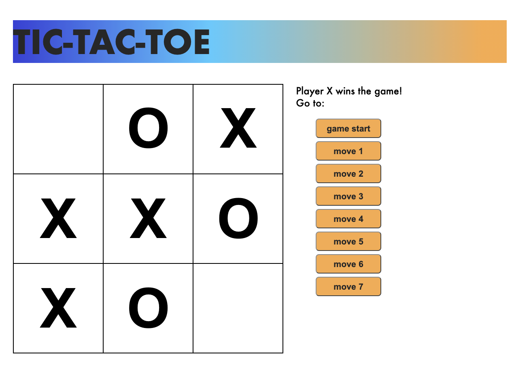

# Tic-Tac-Toe

This project was bootstrapped with [Create React App](https://github.com/facebook/create-react-app) and is based on the following tutorial: [Tutorial: Intro to React](https://reactjs.org/tutorial/tutorial.html#before-we-start-the-tutorial).

A tic-tac-toe game that:

* Lets you play tic-tac-toe
* Indicates when a player has won the game or when the game ends in a draw
* Stores a game’s history as a game progresses,
* Allows players to review a game’s history and see previous versions of a game’s board.

## Available Scripts

In the project directory, you can run:

### `yarn start`

Runs the app in the development mode.\
Open [http://localhost:3000](http://localhost:3000) to view it in the browser.

The page will reload if you make edits.\
You will also see any lint errors in the console.

### `yarn test`

Launches the test runner in the interactive watch mode.\
See the section about [running tests](https://facebook.github.io/create-react-app/docs/running-tests) for more information.

### `yarn build`

Builds the app for production to the `build` folder.\
It correctly bundles React in production mode and optimizes the build for the best performance.

The build is minified and the filenames include the hashes.\
Your app is ready to be deployed!

See the section about [deployment](https://facebook.github.io/create-react-app/docs/deployment) for more information.
